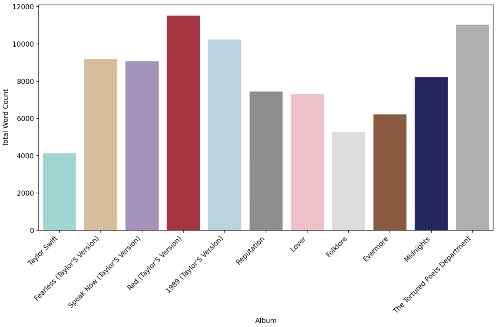
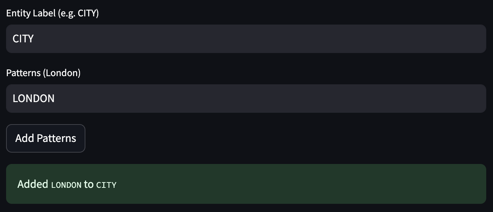
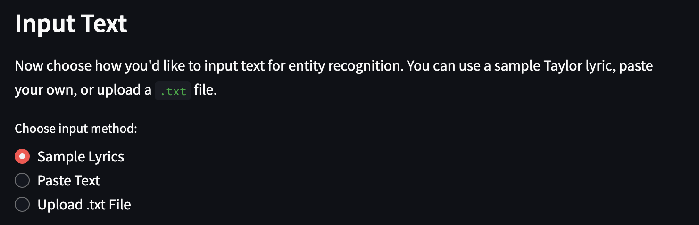
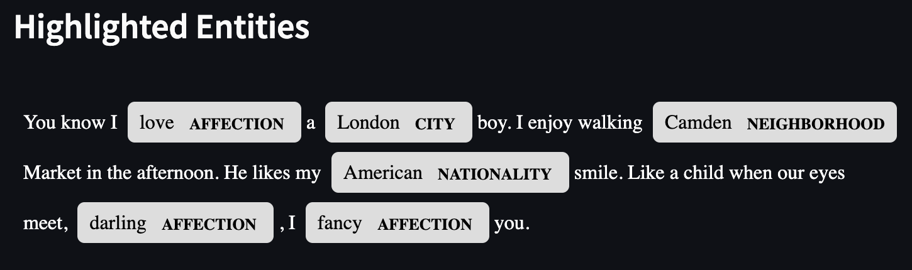

# 🎤 Taylor Swift's Lyrical Legacy: Custom NER + Visual Insights 🎤


**Calling all Swifties!** This interactive Streamlit combines Natural Language Processing (NLP) and data visualization to explore the storytelling evolution of one of the greatest lyricists of our time. This app uses spaCy to implement custom Named Entity Recognition (NER) on Taylor Swift’s lyrics and provides album-based analytics, such as total word counts, to examine lyrical trends.

---

## Project Overview

### Purpose
This app allows fans and analysts alike to:
- Upload or paste Taylor Swift lyrics
- Define custom entities (e.g., "LOVE_INTEREST", "CITY")
- Visualize entity recognition results using spaCy’s `EntityRuler` and `displacy`
- Analyze word counts across albums with themed visualizations

### Why spaCy?
spaCy is a powerful NLP library that supports customizable NER pipelines. 
- The EntityRuler allowers users to build their own recognition rules and make the analysis more fan-personalized
---

## App Features 

## Visualize total word count per album



This bar chart shows the total word count for each of Taylor Swift’s main studio albums, arranged in chronological order. It highlights how her lyrical volume has evolved over time, with a noticeable peak in Red (Taylor’s Version) and The Tortured Poets Department. Albums like Folklore and Taylor Swift feature more concise writing, while others like 1989 and Midnights strike a balance between depth and brevity. Each bar is color-coded to reflect the aesthetic of its corresponding era, offering both a quantitative and stylistic look at Taylor’s discography.


## Custom Named Entity Recognition 
- Add your own entity labels and keyword patterns (e.g., "James" under "LOVE_INTEREST")
- Upload .txt files or paste in your own lyrics
- Visual output with entities highlighted using spaCy’s displacy.render

An NER (Named Entity Recognition) ruler is especially useful for Swifties because it lets fans tag and track recurring names, places, and motifs across Taylor’s lyrics. By creating custom labels like LOVE_INTEREST, CITY, or SYMBOL, fans can uncover deeper patterns in her storytelling—whether it’s identifying how often she references New York or spotting easter eggs tied to specific eras.

### Example Usage
**1. Define a pattern:**
  - Label: CITY
  - Pattern: LONDON



**2. Paste, upload, or use sample lyrics:**





**3. View results:**




---
## How to run the App

You can try the app live here: [**Streamlit App Link**](https://your-app-url.streamlit.app)  
*(Replace with your deployed URL)*

Or, you can download the app locally. Follow these instructions to learn how to do so!

### Make sure you have the required libraries installed
  - streamlit
  - spacy
  - pandas
  - matplotlib
  - seaborn

To install them manually:
```bash
pip install streamlit spacy pandas matplotlib seaborn
python -m spacy download en_core_web_sm
```

1. Clone the repository:
```bash
git clone https://github.com/jsmall16/Small-Python-Portfolio/tree/main/NERStreamlitApp
cd Small-Python-Portfolio/NERStreamlitApp
```

2. Run this command to view the files in the project folder:
```bash
ls
```
3. Move into the directory containing your Streamlit app
```bash
cd NERStreamlitApp
```
4. Launch the Streamlit app by running
```bash
streamlit run Home.py
```
5. Open the App in Your Browser Once the app starts, your terminal will display a local URL (e.g., http://localhost:8501). Click this link or copy and paste it into your web browser to start exploring the app.

---

From the storytelling of Speak Now to the poetry of Folklore and The Tortured Poets Department, this app offers both fans and data enthusiasts a lyrical deep dive into Taylor Swift's evolving artistry.

---

## Sources & Acknowledgements

1. Data
2. spaCy sources
