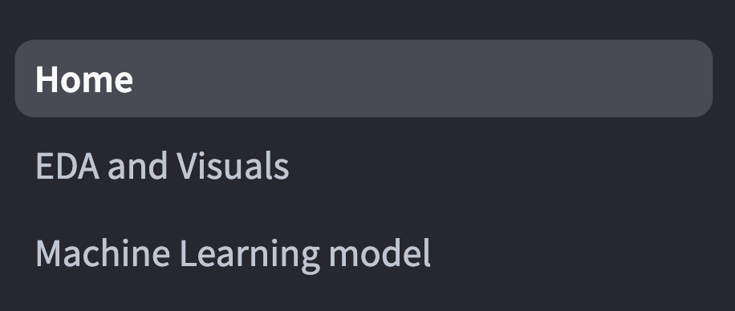
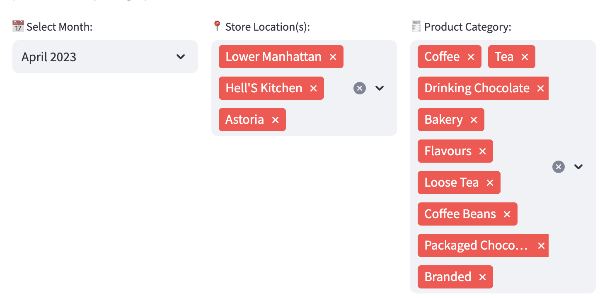
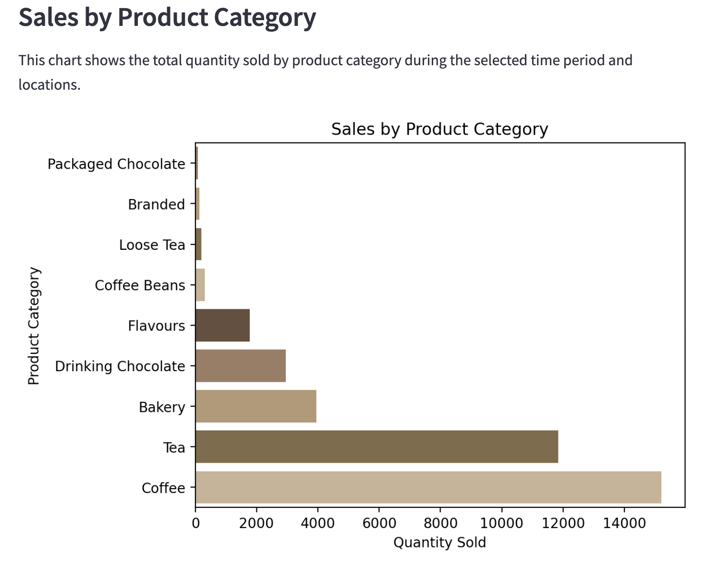
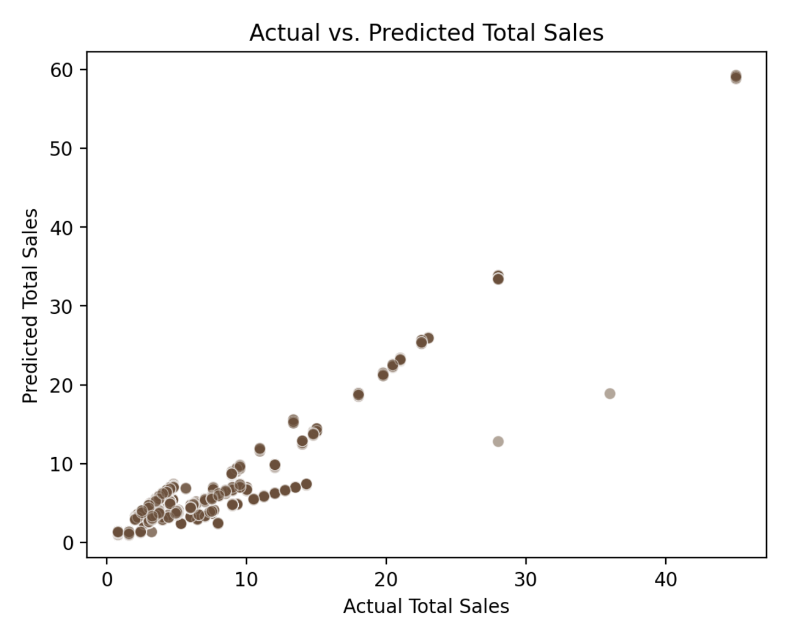
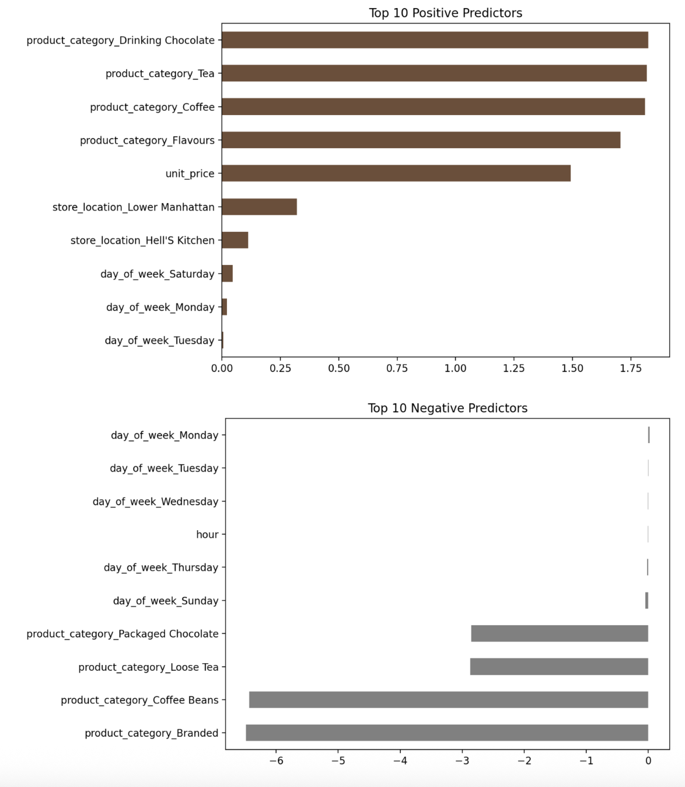
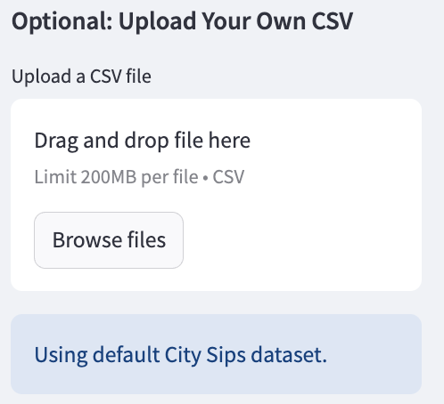

# ☕ City Sips: NYC Coffee Sales App ☕

Calling all coffee lovers and business owners! This interactive Streamlit app is brewed to perfection to meet all your data-driven business needs!

---

## Project Overview 
City Sips solves the problem of unclear sales patterns and inventory planning for coffee shop owners. It is an interactive Streamlit app that helps NYC coffee shop owners and enthusiasts alike to make smarter business decisions. This app will provide strategic insights into: 

- Which products generate the most revenue
- What locations have the most sales
- What time of day should inventory be the most stocked
- ...and more!

---

## Dataset Description
Source: [Kaggle - Maven Roasters: Coffee Shop Sales & Revenue Data](https://www.kaggle.com/datasets/agungpambudi/trends-product-coffee-shop-sales-revenue-dataset/code).
- This dataset contains Over 140,000 transactions collected from 3 different store locations:
    - **Lower Manhattan, Hell's Kitchen, & Astoria**
- Each transaction includes:
    - Store location
    - Date/time of purchase
    - Product category and unit price
    - Quantity sold and total revenue
 
This dataset is critical for providing stakeholders with strategic insights to understand product performance and user behavior.

---

## **Data Pre-Processing steps**

To ensure that the data was ready for analysis, I performed a few different pre-processing steps:
- **Nulls** - removed missing values in columns that were critical to my analysis (price, quantity, etc)
- **Data Type Conversions** - verified that all numeric columns were classiied properly and converted them when needed
- **Date Formatting** - transformed date and time columns into datetime formats to allow for extraction
- **Text cleaning** - made sure column title casing was correct and removed trailing whitespaces to ensure consistency across columns

---

## App Features 

### 1️⃣ **Sidebar Navigation**

The sidebar feature of this app allows you to toggle between different pages, exploring the Home Page, the EDA & Visuals Page, and the Machine Learning Model Page. 



### 2️⃣ **Exploratory Data Analysis**

This section allows users to interact with the data more closely to gain more personalized insights. Users can filter by Month, Store location, or Product Category, to get the most out of their visualizations. 



There are many different visuals in this app that change dyanmically with user selections. These relate to product category, time of day, day of week, and store location. 



### 3️⃣ Machine Learning Model 

The final page of this app utilizes a linear regression model with a ~70% explainability to assess the most and least influential predictors for coffee shop sales. This graph shows a scatterplot of predicted vs. actual sales.



The goal of implementing this model is to help the users identify what factors will forecast future sales, allowing them to stock and staff appropriately. The graphs below display the most and least influential predictors for doing so. 



### 4️⃣ (Optional) User Upload 



If users want even more personalized insights that deviate from the default data, they can upload their own data using this drop box!

---

## How to run the App

You can try the app live here: [**Streamlit App Link**](https://small-python-portfolio-awq8bds5qjqdtabygs9qsv.streamlit.app/)  

Or, you can download the app locally. Follow these instructions to learn how to do so!

### Make sure you have the required libraries installed
- pandas==2.2.3
- streamlit==1.37.1
- matplotlib==3.10.1
- seaborn==0.13.2
- scikit-learn==1.5.1

To install them manually using pip:
```bash
pip install streamlit pandas matplotlib seaborn scikit-learn
```
To get started installing the app:

### **Step 1: Clone the Repository**
```bash
git clone https://github.com/jsmall16/Small-Python-Portfolio.git
```

### **Step 2: Run this command to view the files in the project folder**
```bash
ls
```
### **Step 3: Move into the directory containing your Streamlit app**
```bash
cd StreamlitAppFinal
```
### **Step 4:  Launch the Streamlit app by running**
```bash
streamlit run Home.py
```
Once the app starts, your terminal will display a local URL. Click the link or copy and paste it into your web browser to start exploring the app.
   
---

## 💡 Sources & Acknowledgements

### Data

- [Maven Roasters: Coffee Shop Sales & Revenue Data](https://www.kaggle.com/datasets/agungpambudi/trends-product-coffee-shop-sales-revenue-dataset/code)

### Documentation 

- [Streamlit Cheat sheet](https://cheat-sheet.streamlit.app/)
- [from Data-to-Viz Help Documentation](https://www.data-to-viz.com/)
- [Build a Dashboard in Python Using Streamlit](https://blog.streamlit.io/crafting-a-dashboard-app-in-python-using-streamlit/)
- [Scikit Learn Train-Test-Split Documentation](https://scikit-learn.org/stable/modules/generated/sklearn.model_selection.train_test_split.html)

