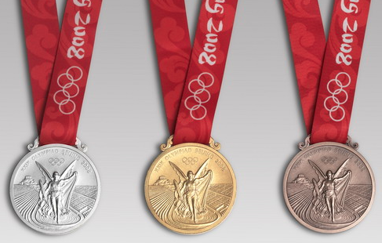

# 🏅 2008 Olympic Medalists: Data Analysis🏅


## Project Overview  
The 2008 Summer Olympics brought together the world’s top athletes competing in various sports, earning gold, silver, and bronze medals for their performances.  

This project cleans, organizes, and analyzes* Olympic medalist data to uncover meaningful insights, including:  
- Which sports had the most medals?
- How were medals distributed between male and female athletes?
- Which gender won the most gold medals in athletics? 
- How does the overall medal distribution break down by type? 

--- 

## Dataset Description
Source: OlympicsGoNUTS 2008 Dataset
- The dataset comes from Olympics Go NUTS, a project by the European Data Journalism Network (EDJNet), which maps Olympic medal counts to European regions using official Olympic data. It provides insights into how different regions performed in the 2008 Olympics, focusing on medal distribution across various sports and demographics.
- The dataset contains 1,875 Olympic medalists across 70 different sports in the 2008 Olympics.

--- 
## Applying Tidy Data Principles  

This analysis follows **Tidy Data Principles** to ensure efficient aggregation, visualization, and further analysis. According to Hadley Wickham, a dataset is tidy when:  
1. Each variable has its own column
2. Each observation is a separate row 
3. Each cell contains a single value
   
## Pre-Processing Steps:
To remain in accordance with tidy data principles, I: 
- Converted wide format data (sports as columns) to tidy long format
- Extracted gender and sport into separate columns
- Removed NaN values and checked for duplicates

After cleansing, here are the column names in the dataset:
- **medalist_name**: Athlete's name
- **sport**: Sport category
- **gender**: Male or Female
- **medal**: Type of medal (Gold, Silver, Bronze)
---

## Data Aggregation 
- Counted total medals per sport
- Analyzed medal distribution by gender
- Focused on Athletics as the highest-medal sport
---
## Data Visualization 
During my analysis, I discovered several compelling insights that reveal interesting trends and patterns:

### Overall Medal Distribution


This pie chart illustrates the overall medal distribution, with gold medals accounting for 35.6%, silver medals at 33.1%, and bronze medals at 31.3%. The data suggests a relatively balanced distribution among the three medal types, with gold being the most awarded.

### Medal County by Sport


This bar chart showcases the top 10 sports by total medal count in the 2008 Olympics, with athletics, rowing, and swimming leading the rankings. The distribution of gold, silver, and bronze medals varies across sports, with athletics and rowing securing the most medals overall.

### Athletics Medal Count by Gender


This bar chart illustrates the 2008 Olympics athletics medal count by gender, showing a fairly balanced distribution between male and female athletes. While silver medals were the most awarded for both genders, males received slightly more bronze medals and females received slightly more gold medals. 

### Concluding Thoughts
This analysis provides a clear overview of how medals were distributed across sports and genders in the 2008 Olympics, highlighting key trends in athletic performance. The findings emphasize the competitive balance across events while showcasing slight differences in medal distribution between male and female athletes.

---

##  How to Run This Project  

### Download the Jupyter Notebook  
- Go to the **GitHub repository**.  
- Click on the **Jupyter Notebook file (`.ipynb`)**.  
- Click **"Download raw"** or **"Download"** and save it to a folder on your computer.  

### **Ensure Python or Anaconda are installed**

### **Download Required Dependencies**
- This installs pandas, matplotlib, and seaborn, which are required for data analysis and visualization.
  
**For Python users**
```bash
pip install pandas matplotlib seaborn
```
**For Anaconda users**
```bash
 conda install pandas matplotlib seaborn
```

### **Open Jupyter Notebook**
Navigate to the folder where you saved the .ipynb file:
- Launch Jupyter Notebook and open the Olympic_Medal_Analysis.ipynb file:
```bash
cd path/to/folder
jupyter notebook
```
---

## Acknowledgments & References  
For further reading: 
- Pandas Cheat Sheet: [Link](https://pandas.pydata.org/Pandas_Cheat_Sheet.pdf)
- Tidy Data Principles: [Link](https://vita.had.co.nz/papers/tidy-data.pdf)

