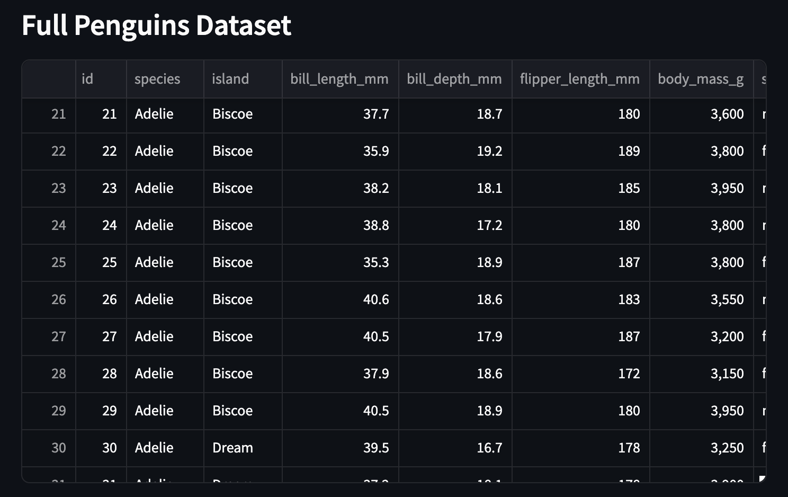
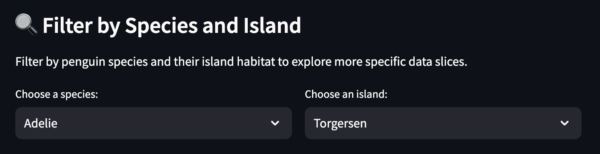
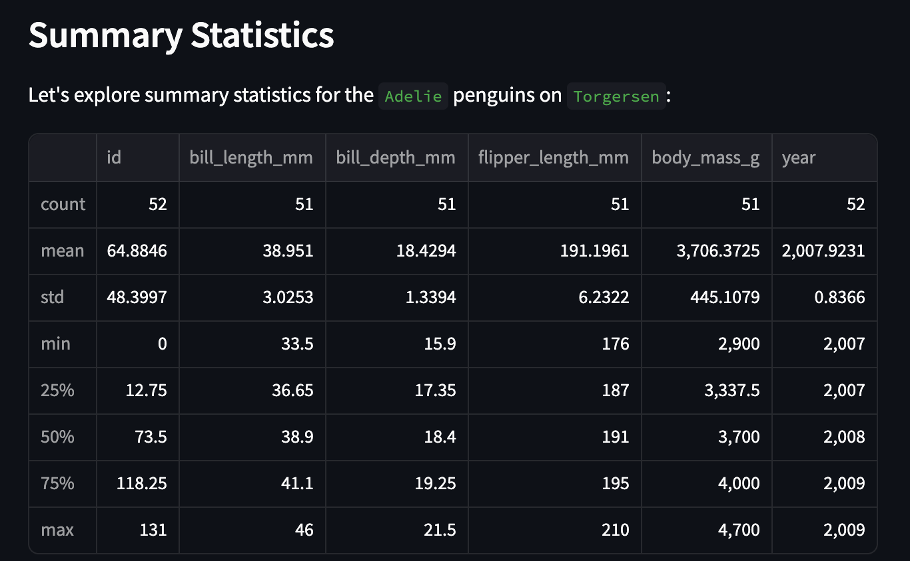
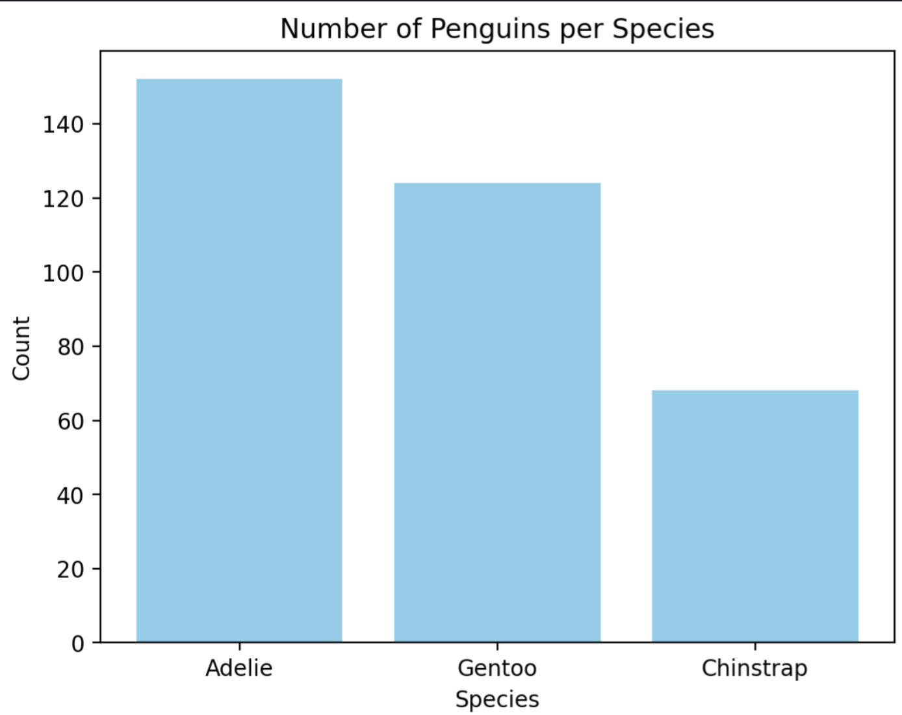

# 🐧 Penguins Data Explorer 🐧


Calling all penguin lovers! The Penguins App offers a clear, user-friendly way to explore penguin characteristics, making data analysis more accessible and engaging. It is the perfect tool for any data scientist or penguin enthusiast!

---

## Project Overview

This app allows users to filter through a dataset of penguins in an interactive way. Users can view the full dataset and then filter it by selecting a specific penguin species or island from a dropdown menu to display only relevant data. The app also provides data visualizations to make the data-exploration process more accessible to all penguin enthusiasts! 

This app will help users to develop an understanding of: 
- Penguin species distribution
- Species-specific traits
- Habitat insights 

---

## Dataset Description

Source: [Palmer's Penguins Dataset](data/penguins.csv).

Each row corresponds to a unique penguin and details their attributes, such as their:
- Species
- Island
- Bill length (mm) 
- Bill depth (mm)
- Flipper length (mm)
- Body mass (g)
- Sex
- Year

It contains all of the necessary features to prep users for their exploration into the world of penguins!

---

## App Features 
Let's explore some of the features in the app!

### 1️⃣ **View Entire Dataframe**
Already loaded into the app, is a concise view of the entire dataset, allowing users to interact with the raw data data and perform their own preliminary explorations.



### 2️⃣ **Apply Filters**
There are also two different dropdown options that allow users to toggle between the islands or species present in the dataset, filtering the dataframe according to their specifications. 



### 3️⃣ View Summaries
Based on the filtering options the user chose, they can view some basic summary statistics for those penguins, such as the count, mean, standard deviation, min, max, and interquartile range. 



### 4️⃣ Visualize!
Finally, at the bottom of the app is a static visualization that helps to picture the distribution of species in this dataset, by displaying a bar chart that shows the count of each species. 



---

## How to run the App

### Make sure you have the required libraries installed
  - streamlit - app visualization
  - pandas - data analysis and manipulation 
  - matplotlib - data visualization

To install them manually using pip:
```bash
pip install streamlit pandas matplotlib 
```
To get started installing the app:

### **Step 1: Clone the Repository**
```bash
git clone https://github.com/jsmall16/Small-Python-Portfolio.git
```

### **Step 2: Run this command to view the files in the project folder**
```bash
ls
```
### **Step 3: Move into the directory containing your Streamlit app**
```bash
cd basic streamlit app
```
### **Step 4:  Launch the Streamlit app by running**
```bash
streamlit run main.py
```
Once the app starts, your terminal will display a local URL. Click the link or copy and paste it into your web browser to start exploring the app.
   
---

## 💡 Sources & Acknowledgements

### Data

- [Palmer's Penguins Dataset](data/penguins.csv)

### Documentation 

- [Streamlit Cheat sheet](https://cheat-sheet.streamlit.app/)
- [from Data-to-Viz Help Documentation](https://www.data-to-viz.com/)
